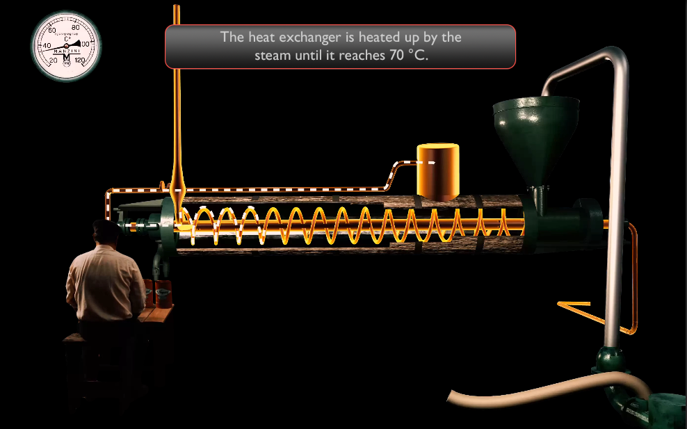

# Tomato Industrial Museum “D. Nomikos” pasteurization-filling machine app

## Description

This Android Augmented Reality application has been developed using Unity Engine for the Tomato Industrial Museum “D. Nomikos” in Santorini, as part of its permanent exhibition. It is a touch-based app designed to give a brief overview of how the pasteurization-filling machine works.

## Requirements

Unity v 2021.3.19.f1

Unity AR Foundation-AR Core

Built for 2800x1752 resolution in landscape orientation

## Screenshots

## License

This project is licensed under the GNU Public License v3.